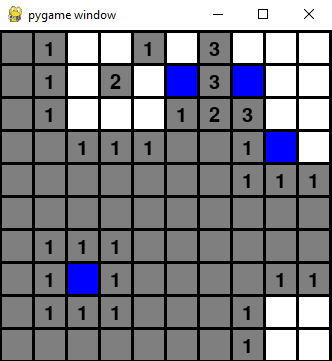

# Minesweeper Game

This is a simple implementation of the classic Minesweeper game, written in Python with PyGame. The game is played by revealing tiles, with the objective of finding all tiles that do not contain a bomb.

## How to Play

To start a new game, simply click once on the game screen.

### Gameplay

- **Left-click** to uncover a tile
- **Right-click** to flag a tile
- Uncover all non-bomb tiles to win
- If you click on a tile with a bomb, you lose

### Restarting the Game

To restart the game, click on the game screen. This will generate a new game board with a random placement of bombs.

## Development

### Technologies

- Python
- PyGame

### Credits

This game was implemented by MSkrobot.

### License

[MIT](https://choosealicense.com/licenses/mit/)
